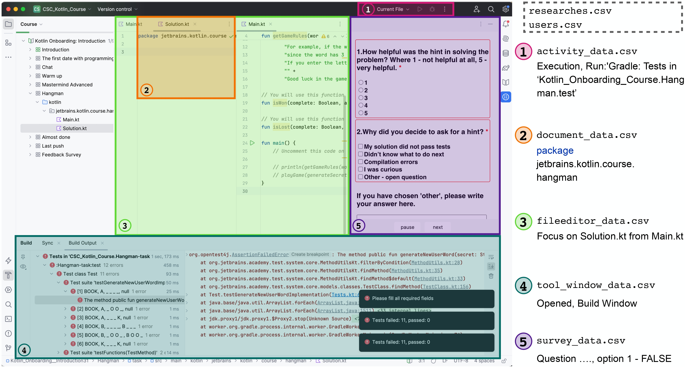

# KOALA (Knowledge Observation and Learning Analytics)

**KOALA** is a powerful tool designed to run controlled experiments and collect data directly within JetBrains IDEs. Its
primary advantage lies in its full customization: with flexible configuration files, **KOALA** can be adapted to suit
any experimental scenario.

The tool's functionality extends beyond basic data collection. By gathering detailed and often hard-to-access
information—such as change logs, code quality metrics, and user interaction patterns — **KOALA** empowers researchers to
conduct deeper, more precise UX studies and behavioral analyses.

This level of insight opens up opportunities to:

- Improve experimental studies by providing richer, more actionable data.
- Streamline user testing for experimental features.
- Facilitate faster iteration and decision-making in UX and product development.
- **KOALA** is built with adaptability in mind, making it an essential resource for teams looking to conduct studies or
  improve development workflows in JetBrains IDEs.

## Collected Data

The plugin is capable of collecting a wide range of data concerning user interactions with the IDE. Some examples are shown in Figure 2:

1. Activities performed in the IDE, e.g., the run action, building the project, using keyboard shortcuts, etc.
2. Current student code
3. Opening, closing, and refocusing of files
4. Opened tool windows, e.g., the Build window, Version Control, Terminal, etc.
5. Survey data if a survey was set up

The plugin also saves some data that was not available in existing tools, such as the used hotkeys, i.e., keyboard shortcuts used to call various actions. The tracking of student interactions with the IDE is carried out with a certain granularity, which is configured separately for code snapshots and for various actions (see more details below).

The described data is collected in CSV files. The examples of individual data points are shown in Figure 2 on the right, and the full collected dataset can be found in supplementary materials. The data is sent to the server at times when a student decides to pause the task or completes it, allowing the plugin to operate under conditions of an unstable internet connection.

Additionally, the plugin allows you to collect not only the previously described data, which is tracked by KOALA itself, but also the data produced by other plugins or tools. For this purpose, in the configuration settings, it is possible to specify the location of the file that will be produced by a third-party tool, and then the file will be sent to the server and further processed. This allows KOALA to obtain an even richer view of students' interactions with the IDE.

The open data that has already been collected can be found [here](https://zenodo.org/records/15553341).

## Easy Configuration and Setup

KOALA is designed for maximum flexibility without requiring source code changes. All experiments can be configured
through YAML configuration files in the plugin. The server component handles data storage and processing, and can be
quickly deployed using docker-compose.

## Getting Started

1. Plugin Setup and Configuration - Check the [plugin documentation](ij-plugin) for detailed instructions on installing
   and configuring the plugin for your experiments.

2. Server Deployment - Refer to the [server documentation](ij-server) for steps to deploy and run the data collection
   server using docker-compose.

Here we want to notice that the plugin and the server would not collect any of the user data outside given tasks.

The [plugin](ij-plugin) works in conjunction with the [server](ij-server), which is located in the same repository. The
server receives, processes, and saves the data that was sent from the plugin side.

## The previous versions of the tool:

- The first version - [repository](https://github.com/JetBrains-Research/task-tracker-plugin)
- The second version - [repository](https://github.com/samorojy/task-tracker-plugin/tree/revival)
