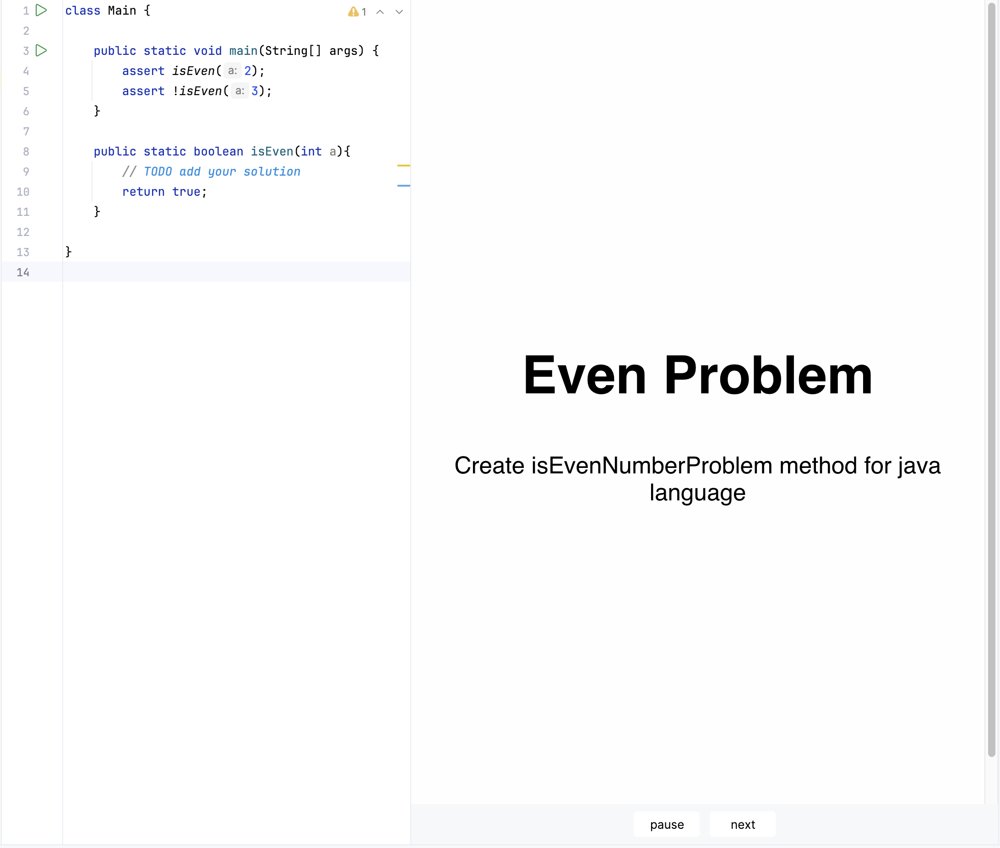
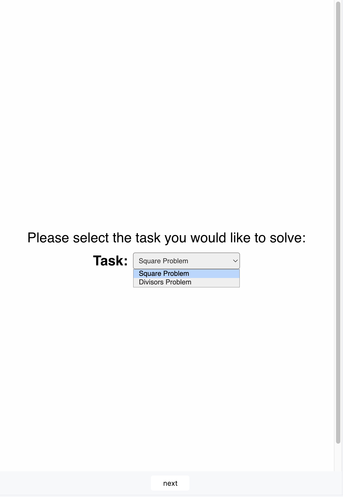
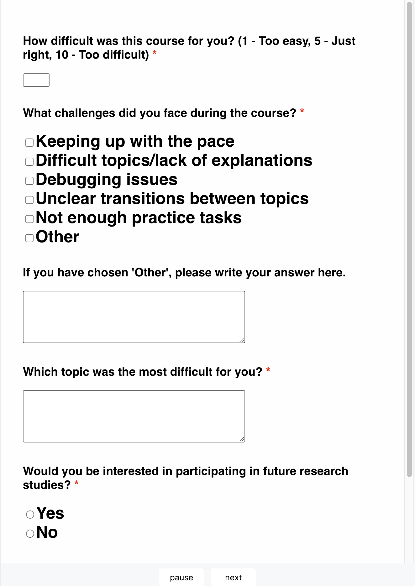
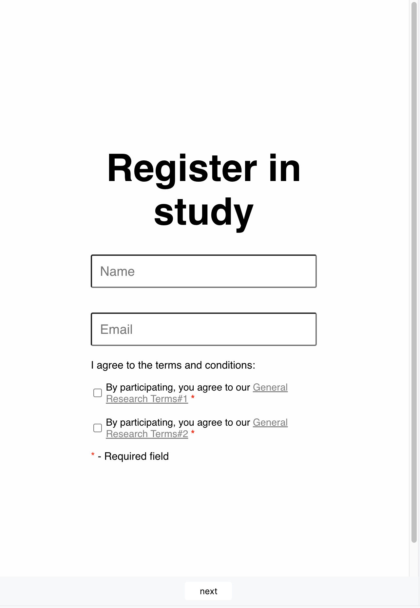
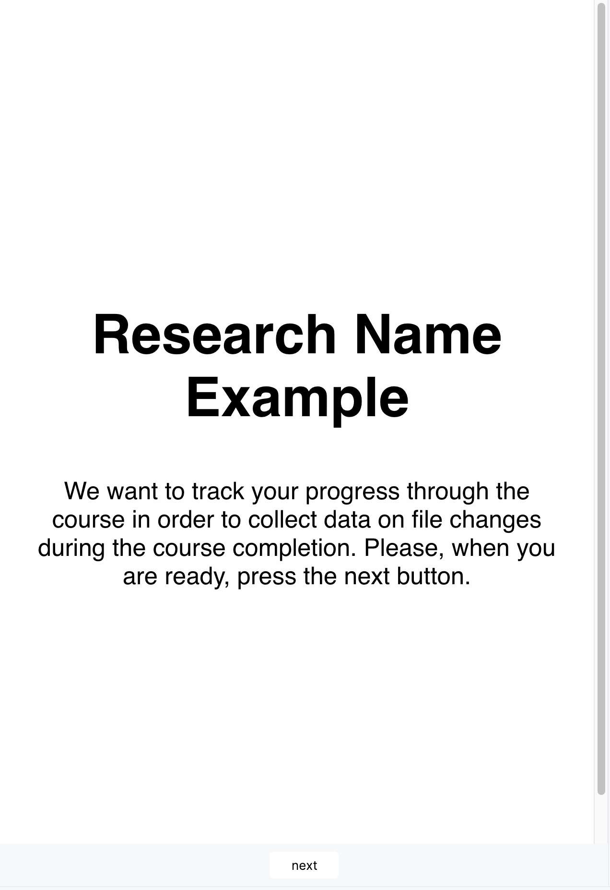
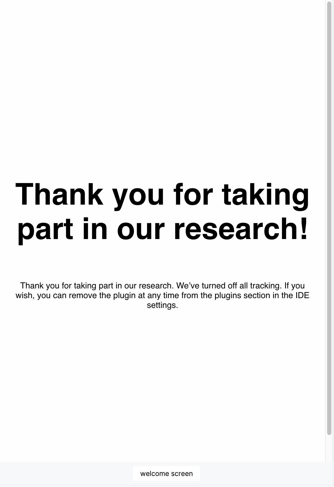
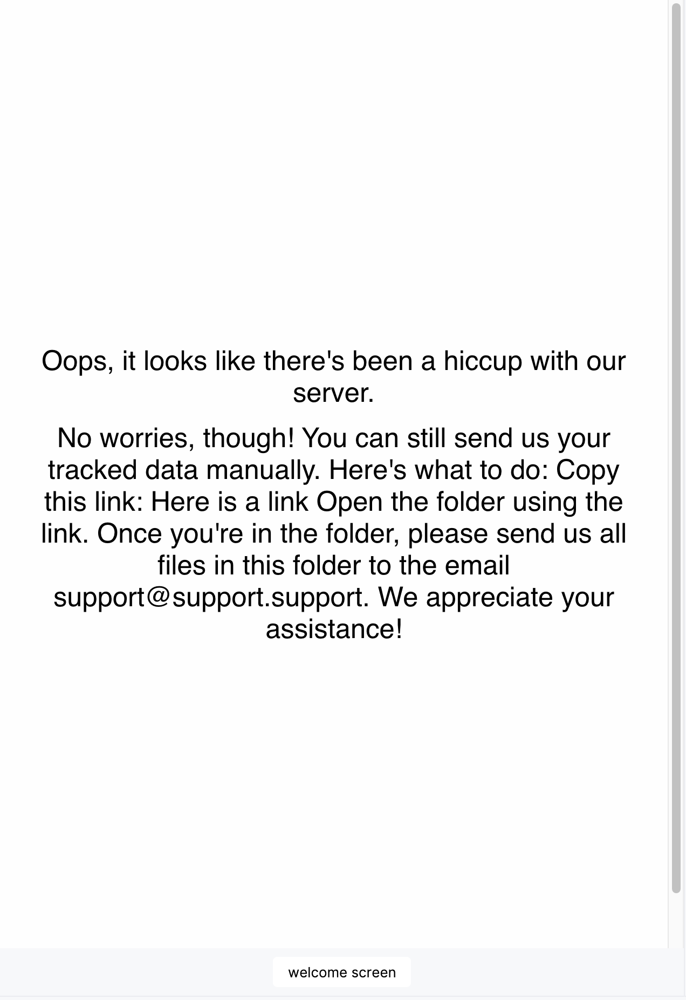

# Tool Data Model Design

This document describes the tool's configuration model design as well as contains
a set of examples of the configuration files to make the setting up process easier.

**Using these configuration files, you can independently and completely customize your experiment to suit your needs.**

---

## 🗒 Overview of All Possible Configs

The list of possible configuration files:

* **Task Content**: label the files that directly affect the experiment and from which data should be collected.
* **Info**: set information about the experiment and associated logs.
* **Agreements**: Identify agreements for those who will participate in the study.
* **Settings and Inspections**: Add restrictions or alternatively add additional features for participants in the
  IDE.
* **Server Error Message and Final Page**: add instructions after the experiment is complete, or if there is an error while interacting with the server.
* **Surveys**: Add the survey that you would like to use in your experiment.
* **Scenario**: Define the scenario in which the tasks will be performed.

All configuration files are language-independent, expect the **Task Content** configuration files which list the files
to track.

---

## 📝 Scenario Config

The **Scenario Config** is a crucial part of the tool. It defines the sequence of events, also known as a "_scenario_," such as:
- The order of tasks and surveys.
- The information displayed to students.

The scenario config dictates how the education process is structured and presented to the student.

In cases where we only need to track students' actions throughout a set of coding tasks, a simple config like the one below is sufficient:

```yaml
scenario:
  steps:
    - units:
        - !<Task>
          id: "isEvenNumberProblem"
        - !<List>
          taskIds:
            - "numberSquareProblem"
            - "findingAllDivisorsProblem"
        - !<SingleList>
          taskIds:
            - "numberAdditionProblem"
            - "numberMultiplicationProblem"
        - !<Survey>
          id: "usageFeedback"
```

In this example:

- The scenario consists of one step, what containing different units, which can represent tasks (like coding
  exercises) or surveys (like feedback forms). Tasks can be defined as single tasks (`!<Task>`) or groups of tasks (
  `!<List>` or `!<SingleList>`) with their respective `taskIds`.
- **List (`!<List>`)**: A group of tasks where the student is required to complete all of the tasks specified within
  `taskIds`, whereas **SingleList (`!<SingleList>`)**: A group of tasks where the student only needs to complete one of
  the tasks specified within `taskIds`.
- A survey unit (`!<Survey>`) is used to collect feedback or usage information from students.

Steps define the overall structure of the scenario and can be either ordered or shuffled, determining the sequence
in which units are presented. Units are the building blocks of a step and consist of tasks or surveys. Tasks are
specific activities (e.g., coding exercises) that students complete individually or as part of a group. Additionally,
any IDE settings applied in units will only have an effect until the end of the current step.

---

## 🗂️ Task Content Config

The **Task Content Config** is the key file for specifying the files in which students will solve their assignments.
This configuration file is **language-specific**.

🔑 Key Features:
- **File Management**: All file paths are configured relative to the root of the current project in the IDE. This ensures personal user information is not collected.
- **Internal Files**: Files marked as `internal` are not created if they already exist, allowing the configuration to accommodate files from third-party plugins or educational tools.
- **File Creation**: If a file doesn’t exist, it will be created with content specified in the configuration, or it will remain empty if no template is provided.

---

📋 Example Configuration

For this example, the following `Task Content Config` file lists all possible locations for the task files:

```yaml
tasks:
  - description: "Create isEvenNumberProblem method for java language"
    id: "isEvenNumberProblem"
    name: "Even Problem"
    focusFileId: "isEvenNumberProblem"
    files:
      - filename: "even"
        sourceSet: "SRC"
        templateFile: "even"
        extension: JAVA
        id: "isEvenNumberProblem"
  - description: "Add method to calculate square number for kotlin language"
    id: "numberSquareProblem"
    name: "Square Problem"
    focusFileId: "numberSquareProblem"
    files:
      - filename: "square"
        sourceSet: "SRC"
        templateFile: "square"
        extension: KOTLIN
        id: "numberSquareProblem"

  - description: "Create method to find all divisors of a number in python"
    id: "findingAllDivisorsProblem"
    name: "Divisors Problem"
    focusFileId: "findingAllDivisorsProblem"
    files:
      - filename: "divisors"
        sourceSet: "SRC"
        templateFile: "divisors"
        extension: PYTHON
        id: "findingAllDivisorsProblem"

  - description: "Add method to perform addition of two numbers for java language"
    id: "numberAdditionProblem"
    name: "Addition Problem"
    focusFileId: "numberAdditionProblem"
    files:
      - filename: "addition"
        sourceSet: "SRC"
        extension: JAVA
        id: "numberAdditionProblem"
  - description: "Add method to perform multiplication of two numbers for java language"
    id: "numberMultiplicationProblem"
    name: "Multiplication Problem"
    focusFileId: "numberMultiplicationProblem"
    files:
      - filename: "multiplication"
        sourceSet: "SRC"
        extension: JAVA
        id: "numberMultiplicationProblem"
```

> **Note**: Task `id` should be connected to an id from the `Scenario` config file




---

📝 Field Descriptions

- **`tasks`**: A list of defined coding tasks.
- **`description`**: A brief description of the task to help guide students during their learning process.
- **`files`**: A collection of files associated with the task. Each file has the following fields:
    - **`extension`**: The file’s programming language or format (e.g., `KOTLIN`, `JAVA`, `PYTHON`, `CPP`, `JUPYTER`).
    - **`filename`**: The file's name.
    - **`isInternal`**: Indicates if the file should be replaced with a new one if they are already exist.
    - **`relativePath`**: The file’s location relative to the project root.
    - **`sourceSet`**: Defines the source set for the file location (e.g., `SRC`, `TEST`).
- **`id`**: The task id is from the *Scenario config*.
- **`name`**: The name of the task as displayed in the course interface.

---

## 📋 Survey Config

The **Survey Config** defines surveys that can be included in your course scenario.
Surveys can contain:
- Single-choice, multiple-choice, or open-ended questions.
- Required questions that students must complete to proceed.

For this example, we will create one question per each question type:

```yaml
surveys:
  - id: usageFeedback
    htmlQuestions:
      - !<Input>
        text: How difficult was this course for you? (1 - Too easy, 5 - Just right, 10 - Too difficult)
        type: number
        min: 1
        max: 10
        elementId: difficult
        required: true
      - !<Checkbox>
        text: What challenges did you face during the course?
        elementId: challenges
        required: true
        info:
          - id: pace
            value: Keeping up with the pace
          - id: explanations
            value: Difficult topics/lack of explanations
          - id: debugging
            value: Debugging issues
          - id: transitions
            value: Unclear transitions between topics
          - id: practice
            value: Not enough practice tasks
          - id: other
            value: "Other"
      - !<Textarea>
        text: If you have chosen 'Other', please write your answer here.
        elementId: challengesOther
        rows: 5
        cols: 50
      - !<Textarea>
        text: Which topic was the most difficult for you?
        elementId: topicDifficult
        required: true
        rows: 5
        cols: 50
      - !<Radio>
        text: Would you be interested in participating in future research studies?
        elementId: participating
        required: true
        info:
          - id: yes
            value: Yes
          - id: no
            value: No
      - !<Textarea>
        text: How would you improve this course?
        elementId: improve
        rows: 5
        cols: 50

```



---

## 🔧 IDE Settings Config

The **IDE Settings Config** specifies the IDE settings to be enabled or disabled while students work on tasks. Examples
of IDE settings include:

- Enabling or disabling **automatic code completion**.
- Enabling or disabling **IDE Zen mode**.
- Changing the **editor theme** (e.g., light or dark mode).

```yaml
enableCodeCompletion: DEFAULT
enableZenMode: DEFAULT
theme: DEFAULT
```

In this setup:

- **enableCodeCompletion**: Controls code suggestion behavior in the IDE (`DEFAULT` keeps users IDE default setting,
  `ENABLED` enables code completion, `DISABLED` disables code completion).
- **enableZenMode**: Determines if Zen mode is enabled, which provides a distraction-free workspace (`DEFAULT` keeps
  users IDE default mode,`ENABLED` enables Zen mode, `DISABLED` disables Zen mode).
- **theme**: Sets the IDE color theme (`DEFAULT` uses the IDE’s standard theme, `LIGHT` enables light theme, `DARK`
  enables dark theme).

---

## 💡 Inspection Config

The **Inspection Config** allows you to enable or disable specific **code quality inspections** by their names.

For example, you might configure it to enable hints about potential issues, such as division by zero.

For this example, we will use the default configuration, what will enable only default inspections:

```yaml
mode: DEFAULT
```

### Other possible options for inspection configuration:

- **ALL**: Enable all available inspections, overriding user settings.
- **NONE**: Disable all available inspections, overriding user settings.
- **DEFAULT**: Keep the default IDE inspection settings without any changes.
- **ENABLE_SELECTED**: Enable only the inspections explicitly specified in the configuration.
- **DISABLE_SELECTED**: Keep the user's existing inspection settings but remove inspections specified in the
  configuration.
- **ADD_SELECTED**: Keep the user's existing inspection settings and add inspections specified in the configuration.

---

## ℹ️ Additional Static Information Configurations

In addition to the main configs above, you can provide static information for students to see before,
during, or after their learning process. For these files you can use HTML notation for formatting. These include:

1. **Research Agreement**:
   Add a link to the research agreement students must read before joining the experiment.
   You can provide as many agreements as possible, be specifying each of them with the `text` field.

    Example configuration: [`agreement_default.yaml`](./agreement_default.yaml)



2. **General Experiment Information**:
   Provide information to display to students in the beginning of the experiment (e.g., guidance or tips).
   This information includes:
   - `researchId` - a unique ID which will help you to download all the data connected to this experiment
   - `pluginName` - this name will be used in the header on the здгпшт page with the research description.
   - `pluginDescription` - this text will be shown on the plugin page, see an example bellow

    Example configuration: [`info_default.yaml`](./info_default.yaml)



3. **Final Page Message**:
   Include a final message to display when students finish all the tasks and submit their data to the server.
    - Example configuration: [`final_page_default.yaml`](./final_page_default.yaml)



4. **Error Message**:
   Specify an error message to display to students if there’s an issue with the server, e.g. lost of connection.
    - Example configuration: [`server_error_default.yaml`](./server_error_default.yaml)

